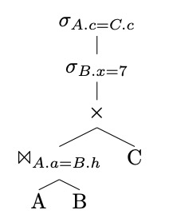

# DBSTUE SS23

This is the repository for your playground, exercises, and homework for Database Systems 2023

# Session 14: 14/06/2023

Sample exam questions/exercises:

## Entity and Relationship 

Design an ER diagram for a car-insurance company whose customers own one or more cars each.
Each car has associated with it zero to any number of recorded accidents.

## Relational Model and Relational Algebra

Given the following RM describing a Library:

User (_ID_, Name, Surname, Address, Email)</br>
Loan (_Placement_, _UserID_, _LoanDate_, ReturnDate)</br>
BookCopy (_Placement_, ISBN, PurchaseDate)</br>
Book (_ISBN_, Title, YearPub, Editor, FirstAuthor, Genre)

Write the following queries in RA:

1. Find the title of all the books published in the '00
2. Find the title of all the books that have not been published in the '00
3. Find the title of Informatics books loaned in June 2020
4. Find name, surname, and ID of users that never took an Informatics book
5. Find the title of all the books loaned or bought in June 2020
6. Find the title of all the books that have never being loaned
7. For each user, return the title of the last book loaned
8. Find the ID of users that have loaned books of all genres


## SQL

Considering the exercise above, complete the following tasks:

### Task 1

Write SQL Commands to create the tables, relations, constraints, etc.

### Task 2

Write the following queries in SQL. Use nested queries and `views` when you see fit.

1. Find the title of all the books published in the '00
2. Find the title of all the books that have not been published in the '00
3. Show all the details of the book "Applied Informatics"
4. Find the title of Informatics books loaned in June 2020, sorted by title
5. Find the title of all the books loaned or bought in June 2020
6. Find name, surname, and ID of users that never took an Informatics book
7. For each genre, find the number of times books of that genre have been loaned.
8. Find name, surname, and ID of users that are overdue.
9. For each genre, find the number of times books of that genre have been loaned.
10. List the genres of books that have been loaned at least 20 times.
11. Find the title of all the books that have never being loaned
12. Find the genre of books with the biggest amount of loans (cumulative)
13. For each user, return the last book loaned


## Normalization

| StaffNo  | DentistName | PatientNo | PatientName | Appointment data and time | SurgeryNo |
|--------|--------|--------|--------|--------|--------|
| S1011  | Tony Smith | P100 | Gillian White | 12-Aug 10:00| S10 |
| S1011  | Tony Smith | P105| Jill Bell | 13-Aug 12:00 | S15 |
| S1024  | Helen Pearson | P108| Ian MacKay| 12-Sept 10:00 | S10 |
| S1024  | Helen Pearson | P108| Ian MacKay| 14-Sept 10:00|S10  |
| S1032  | Robin Plevin | P105 | Jill Bell | 14-Oct 16:00 |S15 |
| S1032  | Robin Plevin | P110 | John Walker | 15-Oct 18:00| S13|

### Task 1
The above table is susceptible to update anomalies. Provide examples of insertion, deletion, and modification anomalies.

### Task 2

Describe and illustrate the process of normalizing the table shown in Figure 1 to 3NF. State any assumptions you make about the data shown in this table.

## Transaction

Given the following schedule:

| Tr  | 1     | 2    | 3    | 4    | 5    | 6    | 7    | 8    | 9    |
|-----|-------|------|------|------|------|------|------|------|------|
| 1   | S(A)  | S(D) |      | S(B) |      |      |      |      |      |
| 2   |       |      | X(B) |      |      |      | X(C) |      |      |
| 3   |       |      |      |      | S(D) | S(C) |      |      | X(A) |
| 4   |       |      |      |      |      |      |      | X(B) |      | 

Check whether the schedule leads to a Deadlock when all the locks are exclusive and when we can distinguish shared and exclusive locks.

Note: The following table shows the lock compatibility os Shared (S) and Exclusive (X) locks:


|   | **S** | **X** |
|---|---|---|
| **S** | OK | – |
| **X** | – | – |


## Query Optimization

### Task 1
With reference to the SQL exercise, write the canonical form of the following queries and provide an optimized version of them. If this is not possible/convenient explain why. 

1. Find the title of all the books published in the '00
2. Find the title of all the books loaned or bought in June 2020
3. For each genre, find the number of times books of that genre have been loaned.
4. Find name, surname, and ID of users that are overdue

### Task 2
With reference to the query plan depicted in the image below:



Improve it. Explain.


## SemiStructured Data

### Task 1

Given the following DTD create an XML file that contains information about five articles
written by three authors.

```
<!DOCTYPE NEWSPAPER [

<!ELEMENT NEWSPAPER (ARTICLE+)>
<!ELEMENT ARTICLE (HEADLINE,BYLINE,BODY)>
<!ELEMENT HEADLINE (#PCDATA)>
<!ELEMENT BYLINE (#PCDATA)>
<!ELEMENT BODY (#PCDATA)>

<!ATTLIST ARTICLE AUTHOR CDATA #REQUIRED>
<!ATTLIST ARTICLE DATE CDATA #IMPLIED>
]>
```

### Task 2

Write the following XPaths/XQuery:

- Return the name of the three authors
- Return the title of last two published articles
- Produce an HTML nested unordered list <UL> that contains a bulled for each author and another unordered list with titles and date of their articles. Both nested lists must be sorted by name of the authors and publication date of the articles


# Session 13: 07/06/2023

Virtual Class: Setup the database assignment.

# Session 12: 31/05/2023

## Semi-Structured Data - XML

### Setup

Find helpful information, tutorials, and examples of DTD, XSD, XPath and XQuery at the following link:
[https://www.w3schools.com/xml/](https://www.w3schools.com/xml/)

Verification of DTD and XSD can be done via: [https://www.xmlvalidation.com/](https://www.xmlvalidation.com/)

Verification of XPath and XQuery can be done via: 
[http://xpather.com/](http://xpather.com/) or 
[https://www.videlibri.de/cgi-bin/xidelcgi](https://www.videlibri.de/cgi-bin/xidelcgi)

For JSON, you can validate JSON against JSON Schema using [https://www.jsonschemavalidator.net/](https://www.jsonschemavalidator.net/) or [https://extendsclass.com/json-schema-validator.html](https://extendsclass.com/json-schema-validator.html)

You can check the syntax of JSON using [https://jsonlint.com/](https://jsonlint.com/) for instance.

### Task 1: DTD
Create a DTD for the given XML File:

```xml
<breakfast_menu>
        <food>
               <name>Belgian Waffles</name>
               <price>$5.95</price>
               <description>Two famous Belgian Waffles with plenty of real maple syrup</description>
               <calories>650</calories>
        </food>
        <food>
               <name>Strawberry Belgian Waffles</name>
               <price>$7.95</price>
               <description>Light Belgian waffles covered with strawberries</description>
               <calories>900</calories>
        </food>
        <food>
               <name>Berry-Berry Belgian Waffles</name>
               <price>$8.95</price>
               <description>Light Belgian waffles covered with fresh berries and cream</description>
               <calories>900</calories>
        </food>
        <food>
               <name>French Toast</name>
               <price>$4.50</price>
               <description>Thick slices made from our homemade sourdough bread</description>
               <calories>600</calories>
        </food>
        <food>
               <name>Homestyle Breakfast</name>
               <price>$6.95</price>
               <description>Two eggs, bacon or sausage, toast, and hash browns</description>
               <calories>950</calories>
        </food>
</breakfast_menu>
```
### Task 2 (Optional): XSD
You could try to create an XSD for the given XML File (Hint: Do not include the DTD from the exercise into the XML when checking the XSD)

### Task 3: XPath

Based on the XML from Task 1, write the following XPaths and their results:

1. Find the 2nd food-Element of the XML
2. Find the name-Element of the last food of the XML
3. Find only the name of the last food of the XML (without tags)
4. Find all foods with calories below 900

### Task 4: XQuery
Based on the XML from Task 1 formulate the following XQuery. Write them down as well as their results.

1. Return the name of every food above 750 calories
2. Return the name and price of each food, ordered by the price in ascending order, to fill a prepared HTML-Table (`<table></table`) with the data. (Make the result look something like this: ```<tr><td>name</td><td>price</td></tr><tr>...```)
3. Return every food if its name starts with a "B"
4. Return for all distinct values of calories as a separate HTML paragraph (`<p></p>`) including their own heading (`<h2></h2>`) and an ordered html list (`<ol></ol>`) of the names of all foods with exactly that many calories. 

    The result is supposed to look like this (actual result has to contain all 5 foods):
    
    ```HTML
    <p>
        <h2>Calories: 900</h2>
        <ol>
            <li>
                <name>Strawberry Belgian Waffles</name>
            </li>
            <li>
                <name>Berry-Berry Belgian Waffles</name>
            </li>
        </ol>
    </p>
    ```

## Semi-Structured Data - JSON

### Task 1: JSON and JSON Schema
Transform (manually) the XML of Task 1 of the previous exercise into a sensible JSON representation (e.g., array of objects). Then create a JSON Schema for it.

### Task 2: JQ

Try to rewrite the XPaths and XQueries from the previous exercise as jq expressions.


# Session 11: 24/05/2023

## NoSQL - Document Database - Mongo DB

### Setup
Start a new mongo db (server):

```docker run --name mongodb -d mongo```

Connect to the running server:

```
docker exec -it mongodb mongosh
```

### Task 1
Try the basic commands:

- `show dbs` Lists all available databases
- `use <db>` Switch current database to <db>
- `show collections` Print a list of all collections for current database
- `exit` Exits the started mongo and thus also the connection to the container

> Note: You can read more here: [https://www.mongodb.com/docs/manual/tutorial/getting-started/](https://www.mongodb.com/docs/manual/tutorial/getting-started/)


### Task 2

Connect to a database called `ex11` and make sure to have the following movies in your `movies`  collection:

1. Title: "Fight Club", Writer: "Chuck Palahniuk", year: "1999", actors: ["Brad Pitt", "Edward Norton"]
2. Title: "Pulp Fiction", Writer: "Quentin Tarantino", year: "1994", actors: ["John Travolta", "Uma Thurman"]
3. Title:"IngloriousBasterds",Writer:"QuentinTarantino",year:"2009",actors:["Brad Pitt", "Diane Kruger", "Eli Roth"]
4. Title: "The Hobbit: An Unexpected Journey", Writer: "J.R.R. Tolkein", year: "2012", franchise: "The Hobbit"
5. Title: "The Hobbit: The Desolation of Smaug", Writer: "J.R.R. Tolkein", year: "2013", franchise: "The Hobbit"
6. Title: "The Hobbit: The Battle of the Five Armies", Writer: "J.R.R. Tolkein", year: "2012", franchise: "The Hobbit", synopsis: "Bilbo and Company are forced to engage in a war against an array of combatants and keep the Lonely Mountain from falling into the hands of a rising darkness."
7. Title:"Pee Wee Herman's Big Adventure"
8. Title:"Avatar"

### Task 3
Update the documents:

1. Add the synopsis "A reluctant hobbit, Bilbo Baggins, sets out to the Lonely Mountain with a spirited group of dwarves to reclaim their mountain home - and the gold within it - from the dragon Smaug." to the move with the title "The Hobbit: An Unexpected Journey"

2. Add the synopsis "The dwarves, along with Bilbo Baggins and Gandalf the Grey, continue their quest to reclaim Erebor, their homeland, from Smaug. Bilbo Baggins is in possession of a mysterious and magical ring." to the movie with the title "The Hobbit: The Desolation of Smaug"

3. Add "Samuel L. Jackson" as an actor to the movie "Pulp Fiction"

### Task 4
With this updated information query the database with the following text search
[https://docs.mongodb.com/manual/text-search/](https://docs.mongodb.com/manual/text-search/):

1. List all movies with the word "Gandalf" in their synopsis
2. List all movies with the word "dwarves" or "hobbit" in their synopsis
3. List all movies with the word "Bilbo" and not the word "Gandalf" in their synopsis

### Task 5
Delete the movies "Avatar" and "Pee Wee Herman's Big Adventure" from your database.
Verify that those movies indeed disappeared


## NoSQL - Graph Database - Neo4j

### Setup

Start a new graph database server:

```docker run --name neo --publish=7474:7474 --publish=7687:7687 --env=NEO4J_AUTH=none -d neo4j```
 
Check that everything is running ok by visiting:

`http://localhost:7474`

Use the GUI to connect to the server and then:

### Task 1

- Lists all available databases (`:dbs`)
- Connect to the `neo4j` database with (`:use <db>`)
- Show an overview of the database (`CALL db.schema.visualization()`) 

More infos at:
[https://neo4j.com/docs/cypher-manual/4.0/](https://neo4j.com/docs/cypher-manual/4.0/)
and

[https://neo4j.com/developer/get-started/](https://neo4j.com/developer/get-started/)

### Task 2

Connect to the running Neo4J with the brower.

Start by following the introduction steps of neo4j, by working through their "Movie Graph" tutorial (`:play movie graph`). 

You can also look here for a step by step guide:
[https://neo4j.com/developer/cypher/guide-cypher-basics/](https://neo4j.com/developer/cypher/guide-cypher-basics/)

Make sure to execute (and verify) the CREATE-Step before trying anything else of this exercise. 

> Note: DO NOT RUN the Clean-up step before completing the exercise, otherwise you won't have data to work with .

1. Show all nodes and their relationships in your database
2. Output the amount of created nodes
3. Output the amount of created relationships
4. Find all titles of movies in the database
5. Return all people, who acted in the Movie with the title "Sleepless in Seattle"
6. Return all actors, who acted besides "Keanu Reeves"
7. Print out the node and the amount of its relationships of the node with the largest amount of relationships
8. Insert a new movie, which is not already in the database, including its actors, director(s) and a producer


# Session 10: 17/05/2023

## Deadlock

Consider the following two transactions: 

T1: 
```
begin
write C 
read B 
write C 
commit
```

T2: 
```
begin
write B 
read C 
read C 
commit
```

### Task 1 
In a DBMS using the two-phase locking algorithm, whether transactions will cause deadlocks depends on how they are executed. If the above two transactions are executed concurrently, under what situations can a deadlock occur?

### Task 2
In a DBMS that has not implemented any concurrency control algorithms, can **non-repeatable reads** occur if the above two transactions are executed concurrently? 


## Performance and Query optimization
Given the following Schema:

```
Student (sid, name, age, address)
Book(bid, title, author)
Checkout(sid, bid, date)
```

And assuming:

- There are 10,000 Student records stored on 1,000 pages.
- There are 50,000 Book records stored on 5,000 pages.
- There are 300,000 Checkout records stored on 15,000 pages. 
- There are 500 different authors.
- Student ages range from 7 to 24.

Given the following SQL query:

```    
    SELECT S.name
    FROM Student S, Book B, Checkout C
    WHERE S.sid = C.sid
    AND B.bid = C.bid
    AND B.author = 'Olden Fames'
    AND S.age > 12
    AND S.age < 20
```

### Task 1:
Show a physical query plan for this query, assuming there are no indexes and data is not sorted on any attribute.

### Task 2: 
Suggest two indexes and an alternate query plan for this query.

### Query Optimization

Consider the schema:
`R(a,b), S(b,c), T(b,d), U(b,e)`

For the following SQL query, give two equivalent logical plans in relational algebra such that one is likely to be more efficient than the other. 

Indicate which one is likely to be more efficient. Explain.
```
    SELECT R.a
    FROM R, S
    WHERE R.b = S.b AND
          S.c = 3
```
          
## Intro to NoSQL MongoDB

Check [these](session10/mongodb.pdf) slides


# Session 09: 10/05/2023

## Transactions 

A schedule, i.e., ordering of operations that belong to different transactions, is **serializable** if it is equivalent to a serial schedule.

A serial schedule consists of executing all the operations comprising a query before executing the operations that belong to the next query.

Are following schedules serializable? Explain your answer.

> Note: `READ (A, t)` stands for reading the value of `A` from the DB and writing to variable `t`, whereas `WRITE (A, t)` stands for store the value `t` in the database as `A`.

### Schedule 1
| T1 | T2 |
|----|----|
|READ (A, t) | | 
| t := t + 100 | |
| WRITE (A, t) | |
| | READ (A, s)| 
| | s := s * 2 |
| | WRITE (A, s) |
| | READ (B, s) |
| | s := s * 2 |
| | WRITE (B, s) |
| READ (B, t) | |
| t := t + 100 | |
| WRITE (B, t) | |

### Schedule 2
| T1 | T2 |
|----|----|
|READ (A, t) | | 
| t := t + 100 | |
| WRITE (A, t) | |
| | READ (A, s)| 
| | s := s * 2 |
| | WRITE (A, s) |
| READ (B, t) | |
| t := t + 100 | |
| WRITE (B, t) | |
| | READ (B, s) |
| | s := s * 2 |
| | WRITE (B, s) |


Solutions: 

- [Group 1](session09/session09-group1.pdf)
- [Group 2](session09/session09-group2.pdf)

## Performance

For this exercise, we need to use an existing database. Among the many sample databases that you find around (e.g., [https://dev.mysql.com/doc/index-other.html](https://dev.mysql.com/doc/index-other.html)) we use the `employee data` a large dataset that includes data and test/verification suite.

The dataset is available also on GitHub:
[https://github.com/datacharmer/test_db](https://github.com/datacharmer/test_db)

### Setup

Before we can use it with MariaDB, we need to run a new container (or restart the one you have used the last time).

Assume we use a new container, run it with:

```
docker run --name mariadbtest -e MYSQL_ROOT_PASSWORD=mypass -p 3306:3306 -d mariadb:latest 
```

Now, connect to the running container and start the `bash` interpreter:

`docker exec -it mariadbtest /bin/bash`

You should see a promo like this:

```
root@25712fc19ceb:/# 
```

At this point, we can run commands just like any other *nix machine.

First, we update the local package repository:

```
root@25712fc19ceb:/# apt-get update
```

Next, we install git:
```
root@25712fc19ceb:/# apt-get install git
```

Then, we clone the Employee DB repo from GitHub:

```
root@25712fc19ceb:/# git clone https://github.com/datacharmer/test_db.git
```

And we follow the instructions to load the database and test it is ok:

```
root@25712fc19ceb:/# cd test_db
root@25712fc19ceb:/test_db#: mariadb --user root -pmypass < employees.sql 
root@25712fc19ceb:/test_db# mariadb --user root -pmypass -t < test_employees_md5.sql

```

Exit from the container:
```
root@25712fc19ceb:/test_db# exit
```

At this point, we have a (large) database available inside the running docker container and we can connect to it for running queries:

```
docker exec -it mariadbtest mariadb --user root -pmypass
```

### Task 1: Query Optimization

- Using the EXPLAIN and ANALYZE statements, execute the following statement and find out the execution plan of it.

```
SELECT * FROM salaries WHERE salary > 150000;;
```
    
- What is the estimated total cost and what the actual total cost of the plan?
- Build an index on the field `salary`. What kind of index was created?

```
CREATE INDEX idx_salary ON salaries(salary);
```

```
SHOW INDEX FROM salaries;
```

- Re-run the query and report its execution plan again.

- What is the estimated total cost and what the actual total cost of the plan?

- Drop the previously created index

```
ALTER TABLE salaries DROP INDEX idx_salary;
```

### Task 2:Query Optimization – ORDER BY

- Using the EXPLAIN and ANALYZE statements, execute the following statements and find out the execution plans of them.

```
  SELECT * FROM employees ORDER BY emp_no;
  
  SELECT * FROM salaries ORDER BY salary DESC;
```

- What is the estimated total cost and what the actual total cost of the plans?

- Which sorting algorithm was used for each of the queries? Why are they different?

- Build an index for the second query on the field `salary `.

- Re-run the second query and report its execution plan again.

- What is the estimated total cost and what the actual total cost of the plan?

- Explain briefly why the sorting remained the same or changed after building the index.

- Change the second query and report changes in the analysis.

```
SELECT * FROM salaries WHERE salary > 150000 ORDER BY salary;

SELECT * FROM salaries ORDER BY salary LIMIT 10;
SELECT * FROM salaries ORDER BY salary LIMIT 1000;
SELECT * FROM salaries ORDER BY salary LIMIT 10000;
```

- Drop all the previously created indices

# Session 08: 03/05/2023

## Normalization

|StudID |CourseID |StudName |CourseName |Grade| FacName |FacPhone|
|-----|-----|-----|-----|-----|-----|-----|
1 | PROG2, DBSE2UE | Adams | Prog2, Database | 1, 2 | Dhungana, Gambi | 1234, 1122
2 | PROG2 | Jones | Prog2 | 3  | Dhungana | 1234
3 | PROG2 | Smith | Prog2 | 1  | Dhungana | 1234
4 | PROG2, DBSE2UE| Baker | Prog2, Database | 3, 1 | Dhungana, Gambi| 1234, 1122


Functional Dependencies:

- StudID → StudName
- StudID, CourseID → Grade
- CourseID → CourseName
- CourseID → FacName
- FacName → FacPhone

Given this information, put the above table in (1) 1NF, (2) 2NF, (3) 3NF and lastly present the final set of tables (as a RM) with meaningful names and mark the PKs.
                     
## Transactions

In the lecture we covered different Isolation Anomalies:

- Dirty Read
- Non-Repeatable Read
- Phantom Read
- Serialization Anomaly. 

In there slides, you can find some examples of SQL queries that would result in those anomalies.

Try them out yourself using MariaDB on docker and document your experiences/solutions.

> Note: To simulate concurrent transactions you need two clients and issue the commands manually in the same order. Clients can be two separate connections to the DB or two instance of the Database CLI.

# Session 07: 26/04/2023

## Views and Queries with Views

### Task 1 
Create a table based on the following RM and let `note` have the default value "Hello World"

```
test01(key: integer, value: integer, note: string)
```

Now create a View on top of the previously created table `test01`, accessing only the attributes `key` and `value`.

Try to insert and update values in that view. How does the table change?

### Task 2

Create another table in the same db as `test01` based on the following RM:

```
test02(key: integer, test01.key: integer, name: string, note: string)
```

Insert 2 related entries into these databases, then create a view that presents the attributes `key` and `value` from `test01` and the attribute `name` from `test02`.

Try to insert and update values in that view. How does the table change?

### Task 3

Update the foreign key from `test02` by adding an ON UPDATE and ON DELETE clauses. Make sure they are different, i.e., produce different effects.

1. Which update/delete clause did you choose?
2. Present how the update/delete clause effected your test02 entry, after updating/deleting the related entry of test01

## Functional Dependency

### Task 1 
Given a relation R = (A, B, C, D) with the following functional dependencies, list all candidate keys of R:

- A→B
- B→C
- C→D
- D→A

> Can you find an real-life example in which these constraints hold?

### Task 2 
Given a relation R = (A, B, C, D) with the following functional dependencies, list all candidate keys of R:

- AB→C
- C→D
- D→A

> Can you find an real-life example in which these constraints hold?


# Session 06: 19/04/2023

## Keep going with the queries:

Write all the queries from Session 05

## More queries

Consider a database with the following relational model (schema):

Person (name, age, gender)

Frequents (name, pizzeria) 

Eats (name, pizza)

Serves (pizzeria, pizza, price)

Write SQL expressions for the following three queries:

- Find the names of all people who frequent only pizzerias serving at least one pizza they eat.

- Find the names of all people who frequent every pizzeria serving at least one pizza they eat.

- Find the pizzeria serving the cheapest pepperoni pizza. In the case of ties, return all of the cheapest-pepperoni pizzerias.


## Deal with References
A person changes name, update the foreign keys of the related relationships.

Add an update and delete clause and test them.


# Session 05: 12/04/2023

## Setup:

Create the following  structure in your private repo:

```
session5/
├── setup_database.py
└── tests
    ├── conftest.py
    ├── test_my_database.py
    └── __init__.py
```

## Exercise 1: 

Consider a database with the following relational model (schema):

Person (name, age, gender)

Frequents (name, pizzeria)

Eats (name, pizza)

Serves (pizzeria, pizza, price)

### Task 1: Use SQL as DDL.

Implement the Relational Model into a SQLITE database.

Pay attention to domains, types, and define appropriate constraints.

Bonus: Define your own domain

Use a python script `setup_database.py` to automatically create the database and make sure it follows the database factory pattern.

Question: What error do you get if you try creating the same table twice?

### Task 2: Use SQL as DML.

Write SQL expressions that fills up the database with test data.

Pay attention to respect all the constraints and include NULL values if possible.

Use one of more fixtures to create (pseudo) random values, i.e., define appropriate data factories.

Question: What error do you get if you try to insert the same key twice?

### Task 3: Use SQL as QL.

Write SQL expressions implementing the following queries:

1. Find all pizzerias frequented by at least one person under the age of 18.
2. Find the names of all females who eat either mushroom or pepperoni pizza (or both)
3. Find the names of all females who eat both mushroom and pepperoni pizza.
4. Find all pizzerias that serve at least one pizza that Amie eats for less than $10.00
5. Find all pizzerias that are frequented by only females or only males.

6. For each person, find all pizzas the person eats that are not served by any pizzeria the person frequents. Return all such person (name) / pizza pairs.
7. Find the names of all people who frequent only pizzerias serving at least one pizza they eat.
8. Find the names of all people who frequent every pizzeria serving at least one pizza they eat.
9. Find the pizzeria serving the cheapest pepperoni pizza. In the case of ties, return all of the cheapest-pepperoni pizzerias.


# Session 04: 29/03/2023

## Exercise 1: 

Consider a database with the following relational model (schema):

- Person (<ins>name</ins>, age, gender)
- Frequents (<ins>Person.name, pizzeria</ins>) (this is a N:M relation)
- Eats (<ins>Person.name, pizza</ins>) (this is a N:M relation)
- Serves (<ins>pizzeria, pizza</ins>, price, allergens)

>> NOTE: Limit genders to male/female/other


## Step 1: Write relational algebra expressions for the following queries:

Available Operators
RENAMING(R)
UNION (U), INTERSECTION (i), DIFFERENCE (/)
PROJECTION (P), SELECTION (S)
CARTESIAN PRODUCT (x)


d) Find all pizzerias that serve at least one pizza that Amy eats for less than $10.00.

> Selecte relevant Relation
Serves, Eats

> Select Amy's preferred Pizzas
PizzasAmyLoves = R[Amy.pizza <- pizza] (P[ pizza ] - ( S [ Person.name == "Amy" ] - (Eats)) -> (Amy.pizza) )

> From serves we need pizzeria for name, price for the condition and pizza to match amy's favorites

> Get the less than 10s pizza that Amy's like
AffordablePizzasAmyLoves = S[ price < 10 ] (S[Amy.pizza == pizza] - (PizzasAmyLoves x Serves) ) -> (Amy.pizza, pizzeria, pizza, price, allergens)

> We need the name of the pizzeria

P[ pizzeria ] - ( AffordablePizzasAmyLoves )


>> How to test it?

Write the query in SQL

SELECT Pizzeria, 
FROM Eats JOIN Serves ON Eats.pizza = Serves.pizza
WHERE Serves.price < 10

>> Write the test cases:

Input: We have some database INSTANCE
Expected Output: we have some (or none) TUPLES

> Test 1
If I have this input:

Eats: (Alessio, Margherita)
Serves: (PizzaGO, Margherita, 12, ...)

Expect Output:

[] - Empty

> Test 2
If I have this input:

Eats: (Amy, Margherita)
Serves: (PizzaGO, Margherita, 12, ...)

Expect Output:

[] - Empty

> Test 3
If I have this input:

Eats: (Amy, Margherita)
Serves: (PizzaGO, Margherita, 9.95, ...)

Expect Output:
[ PizzaGO ]

> Test 4
If I have this input:

Eats: (Amy, Margherita), (Amy, Marinara)
Serves: (PizzaGO, Margherita, 9.95, ...), (Domino, Marinara, 9.95, ...)

Expect Output:
[ PizzaGO, Domino ]

> Test 4
If I have this input:

Eats: (Amy, Margherita)
Serves: (PizzaGO, Margherita, 9.95, ...), (Domino, Marinara, 9.95, ...)

Expect Output:
[ PizzaGO ]

Find all pizzerias that serve at least one pizza that Amy eats for less than $10.00.


e) Find all pizzerias that are frequented by only females or only males.

f) For each person, find all pizzas the person eats that are not served by any pizzeria the person frequents. Return all such person (name) / pizza pairs.

g) Find the names of all people who frequent only pizzerias serving at least one pizza they eat.

h) Find the names of all people who frequent every pizzeria serving at least one pizza they eat.

i) Find the pizzeria serving the cheapest pepperoni pizza. In the case of ties, return all of the cheapest-pepperoni pizzerias.


c) Find the names of all females who eat both "mushroom" and "pepperoni" pizza.

Result = WomenPepperoni INTERSECTION WomenMushroom

S [WP1 = "mushroom" AND WP2 = "pepperoni" ] - (SelfJoined)
OR
S [WP2 = "mushroom" AND WP1 = "pepperoni" ] - (SelfJoined)


b) Find the names of all females who eat either "mushroom" or "pepperoni" pizza (but NOT both of them).

> Select the relevant Tables/Relations

Person
Eats

> Intersect works onlyl for same set of attributes
so we cannot intersect (name, age, gender) INTERSECT (Person.name, pizza)

> We do the cross product
(Person x Eats) -> (name, age, gender, Person.name, pizza)

> We select the cross product by making sure that the persons' name matches
S[ name == Person.name ] - (Person x Eats) -> (name, age, gender, Person.name, pizza)

> We project to eliminate the duplicate name
PersonEatsJoined = P[ name, age, gender, pizza] - (Person x Eats) -> (name, age, gender, pizza)

> Select all the women
WomenPizza = S [ gender = "female" ] - (PersonEatsJoined) -> (name, age, gender, pizza)

> Select what the eat
WomenPepperoni = S[ pizza = "pepperoni" ] - (WomenPizza) -> (name, age, gender, pizza)
WomenMushroom = S[ pizza = "mushroom" ] - (WomenPizza) -> (name, age, gender, pizza)

> Use the union! But does not work, becauyse it also includes the one that eat BOTH pizza
WomenPepperoni U WomenMushroom -> Not good, because it also includes the persons that eat both

> Compute the SymmetricDifference
WomenPepperoni INTERSECTION WomenMushroom -> I get ONLY the one the eat both

(WomenPepperoni U WomenMushroom) / (WomenPepperoni INTERSECTION WomenMushroom)

XOR

*** Use a smarter selection!
> Option 1: OR Does not work because it gets both
Result = S[ pizza = "pepperoni" OR pizza = "mushroom" ]- (WomenPizza) -> (name, age, gender, pizza)

> Option 2: OR Does not work because it gets none
Result = S[ (pizza = "pepperoni" OR pizza = "mushroom") AND NOT (pizza = "pepperoni" AND pizza = "mushroom")]- (WomenPizza) -> (name, age, gender, pizza)

Alessia, 17, pepperoni
Alessia, 17, mushroom
Diana, 45, pepperoni

The conditions are evaluate on ONE TUPLE at the time
so pizza = "pepperoni" AND pizza = "mushroom" is trivially FALSE

SELF-JOIN
SelfJoined = P[WP1.name, WP1.age, WP1.gender, WP1.pizza, WP2.pizza] ( S[WP1.name = WP2.name] - (WomenPizza as WP1 x WomenPizza as WP2))
 -> (name, age, gender, pizza, pizza)

Alessia, 17, pepperoni, pepperoni
Alessia, 17, mushroom, pepperoni
Alessia, 17, pepperoni, mushroom
Alessia, 17, mushroom, mushroom

Diana, 45, pepperoni, Diana, 45, pepperoni

S [WP1 = "mushroom" AND WP2 = "pepperoni" ] - (SelfJoined)

Alessia, 17, pepperoni, pepperoni
Alessia, 17, mushroom, mushroom
Diana, 45, pepperoni, Diana, 45, pepperoni <<>>

Diana

>> Is this indeed possible without interesection and union? Find it out @ Home


a) Find all pizzerias frequented by at least one person under the age of 18.

> What relation(s) do you need to solve this query?

Frequents
Person

Person Instance:

Alessio, 41, Male
Alan, 17, Male
Bella, 17, Female
Charlie, 12, Male

Frequents Instance:

Alessio, GoPizza
Alan, PizzaDomino
Bella, PizzaDomino
Charlie, MamaPizza


- First we have to join Frequents and Selection from Person
> Select underage persons

UnderAge = S [ age < 18 ] - (Person) -> (name, age, gender)
(Alan, 17, Male)
(Bella, 17, Female)
(Charlie, 12, Male)

Join Frequents with UnderAge over Person.name from Frequents and name from UnderAge

Frequents x UnderAge -> (Person.name, pizzeria, name, age, gender)

> How many items has the cross product?

If you have S and T, what's the size of S x T, i.e., |S x T| ? |S| * |T|

Counts all possibilties! We need to make sure we represent consistently the relation Frequents

(Alan, 17, Male)
(Bella, 17, Female)
(Charlie, 12, Male)

Alessio, GoPizza
Alan, PizzaDomino
Bella, PizzaDomino
Charlie, MamaPizza

(Alessio, GoPizza), (Alan, 17, Male)
(Alessio, GoPizza), (Bella, 17, Female)
(Alessio, GoPizza), (Charlie, 12, Male)

(Alan, PizzaDomino), (Alan, 17, Male)
,,,
...

> Filter by name of person that matches over the relations
S[ Person.name == name ] - (Frequents x UnderAge)

PizzaDomino, Alan, Alan, 17, Male
PizzaDomino, Bella, Bella, 17, Female
MamaPizza, Charlie, Charlie, 12, Male

UnderagePizza = P[ pizzeria, name, age ] - ( S[ Person.name == name ] - (Frequents x UnderAge) )

The projection requires a list of attributes to work

PizzaDomino, Alan, 17
PizzaDomino, Bella, 17
MamaPizza, Charlie,12

Result = P[ pizzera ] - (UnderagePizza)

(PizzaDomino, MamaPizza)


c) Find the names of all females who eat both "mushroom" and "pepperoni" pizza.

d) Find all pizzerias that serve at least one pizza that Amy eats for less than $10.00.

e) Find all pizzerias that are frequented by only females or only males.

f) For each person, find all pizzas the person eats that are not served by any pizzeria the person frequents. Return all such person (name) / pizza pairs.

g) Find the names of all people who frequent only pizzerias serving at least one pizza they eat.

h) Find the names of all people who frequent every pizzeria serving at least one pizza they eat.

i) Find the pizzeria serving the cheapest pepperoni pizza. In the case of ties, return all of the cheapest-pepperoni pizzerias.

## Step 2: Implement the database and the queries in Sqlite

- Implement the database in Sqlite
- Write fixtures to insert data and create test databases
- Read about queries and SQL operators online (try not to use ChatGPT, instead face the challenge of understanding something on your own)
- Write some queries using the Sqlite command line interface or GUI
- Implement those queries in python using "query templates" and "bulk/batch" insert
- Tests whether the queries give you the results you expect (from Step 1 and some test data you can guess what should be the result of -at least some- those queries)
    - Are all the tuples there?
    - Do the resulting tuples have the right attributes names?
    - Do the resulting tuples have all the expected attributes?


## Step 3: Reverse Engineer an ER Model for the Relational Schema

- Having an ER helps with documenting your database and spot possible inconsistencies

# Session 03: 22/03/2023

### Setup

- create a folder `session3`
- inside the `session3` folder create the `session3.py` module
- inside the `session3` folder create a `tests` folder
- inside the `session3\tests` folder create `test_session3.py` and a `conftest.py`

>> NOTE: `conftest.py` enables you to share fixtures across tests. It is loaded automatically by `pytest`, and any fixtures defined in it are available to test modules in the **same directory and below** automatically. 

- the "production database" must be stored under `session3` and is called `session3.db`


## Exercise 1: Create a Database for the University Example

- Given the University ER Model presented in class briefly describes what entities and relations it contains

- Design a Relational Model from the ER Model. Limit yourself to represent all the entities (Professor, Assistant, Student, Lecture) and the following relationships:
    -   workFor
    -   hold
    -   attend 
    -   require

>> NOTE: think on how you could/should deal with the different cardinalities

- Implement the Relational Model into Sqlite

- Fill it with some test data (using python code!)


## Exercise 2: Create Test Fixtures for the Database

- Refactor you code to improve testability
    - for instance, you can store queries into variables

- Implement the following test fixtures that return a connection to a sqlite database:

    - connection_to_empty_db: creates a test database with schema from Exercise 1 using a temporary file 
        
    - connection_to_fresh_test_db: creates a test database with schema from Exercise 1 filled with test data (from exercise 1) using a temporary file. The data must be inserted using queries.
    
    - connection_to_stored_test_db: creates a test database with schema from Exercise 1 filled with test data (from exercise 1) by copying an existing test database into a temporary file

- Write tests that check constraints of the implemented relations (e.g., cardinality). Test both positive and negative cases (asserting that Exceptions are raised during tests execution)

## Exercise 3: Extend the database

- Extend the ER model to include the concept of Tutor. Tutors are students that work for the faculty, thus are employees, and are assigned to a lecture. A lecture can have only one tutor, but the same tutor can be tutoring up to 3 lectures.

- Update the Relational Model to include the new changes in the ER Model

- Implement the new Relational Model by extending the code

- Fix the broken tests/fixtures

- Implement tests that check the new relations


# Session 02: 15/03/2023

## Exercise 1: Play around with sqlite (2)

- Complete the Exercise 2 from the previous lecture (install sqlite, write code to create a database, write a code to connect to a database)

- create a folder `session2`
 
- inside the `session2` folder create a module `test_session2.py`

- inside the `test_session2.py` module write a test that
    1. creates a database `test-db.db`
    2. table `Professor` with attributes `PersNr` (int), `FirstName` (string/varchar), and `LastName` (string/varchar) 
    3. insert the professor (123, Foo, Bar)
    4. insert the same professor (123, Foo, Bar) again
    5. assert that the second query fail

    Can you make the test fail?

- Fix the previous test to make the assertion fail (hint, define a PRIMARY KEY)

- write another test that
    1. connect to `test-db.db`
    2. create a second professor (234, Donald, Duck)
    3. check that the `Professor` contains two entries one for (123, Foo, Bar) and one for (234, Donald, Duck). Note the order does not matter

    What's the issue with those test cases?

## Exercise 2: Get you testing environment right

- Read about Xunit style of tests [https://docs.pytest.org/en/7.2.x/how-to/xunit_setup.html](https://docs.pytest.org/en/7.2.x/how-to/xunit_setup.html)

- Update the `test_session2.py` module and implement a setup and a teardown. The test setup ensures that the database and the table exists, the teardown module ensures that the database is removed afterwards

- execute the two tests and verify that now the second test (checking the two entries) fail

- fix the second test case to make it pass. Discuss how

- Read about Pytest Fixtures [https://docs.pytest.org/en/7.2.x/explanation/fixtures.html](https://docs.pytest.org/en/7.2.x/explanation/fixtures.html)

- Read about TempFiles/Folders [https://docs.pytest.org/en/7.2.x/how-to/tmp_path.html](https://docs.pytest.org/en/7.2.x/how-to/tmp_path.html)

- replace the setup and teardown methods with a fixture that initialize the database using a temporary file and fills

## Exercise 3: Understand ER Model

- Given the University ER Model presented in class briefly describes what entities and relations it contains

- Think of how you could implement this model into a database. (Do not implement it... just think about possible mapping between those entities and tables)


# Session 01: 08/03/2023

## Exercise 1: Setup Your Environment

- Checkout this repo
- Check if there are already registered Git submodules
- **Initialize** the git submodule for the public repository
- Create a folder `exercise.01`
- Inside the `exercise.01` folder, create a python virtual environment called `.venv`
- Activate `.venv` and install pytest, pymock, pycoverage
- Create a `tests` folder (remember the `__init__.py` file)
- Write a simple (passing) test
- Run the tests and check that all pass

## Exercise 2: Play Around with Sqlite

- Go to [https://www.sqlite.org/index.html](https://www.sqlite.org/index.html)
- Download and install sqlite3
- Read the documentation to find out how you can use sqlite3 from python (maybe check also [https://docs.python.org/3/library/sqlite3.html](https://docs.python.org/3/library/sqlite3.html)
- Activate `.venv`
- Install `sqlite3` python library
- Create a database `exercise.01.db` inside the `exercise.01` folder
- Write a test that check the database file exists
- Write a test that connect to the database and lists the tables inside it
- *Manually* create a new table called `Test` with attributes `Id` integer, `Desc` String/Text
- Run the test and check that the Test table exists

## Exercise 3: Modeling an Application Domain

Select an application domain and identify possible entities, their attributes, and relationship among them

Example: 

Domain: Education and Class Attendance

Entities: Students, Courses, Sessions

Relationships:
    
- Students attend a session (on a date) of a course
- Courses are made of sessions
    

Other possible application domains to model:

- Scientific Conference Publishing (a paper is authored by many authors and published at a conference, a paper cites other papers, other papers cite this paper)

- Music
- Library
- Health
- Insurance
